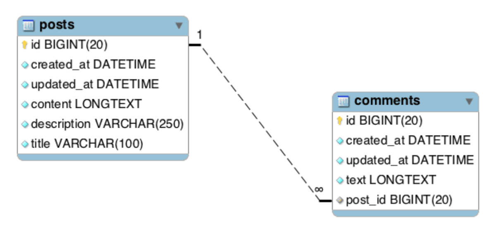
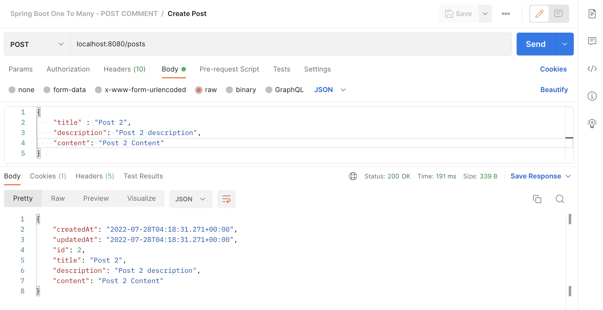
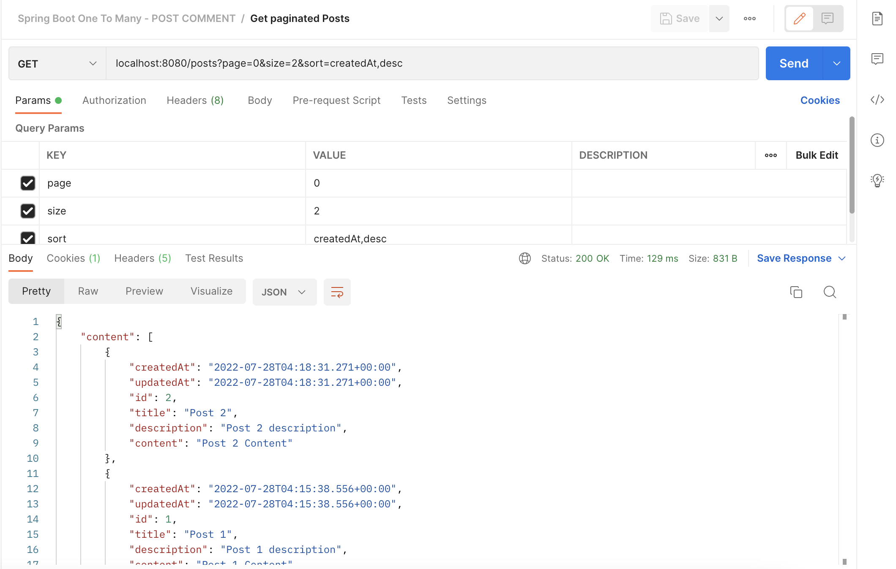
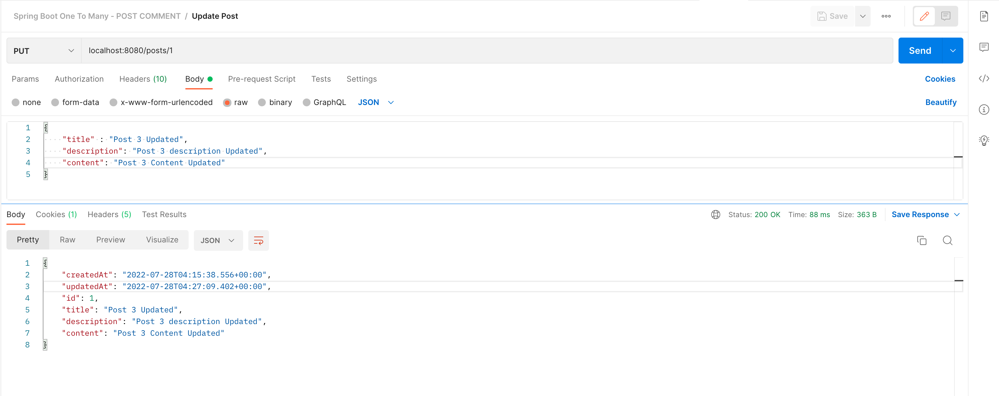
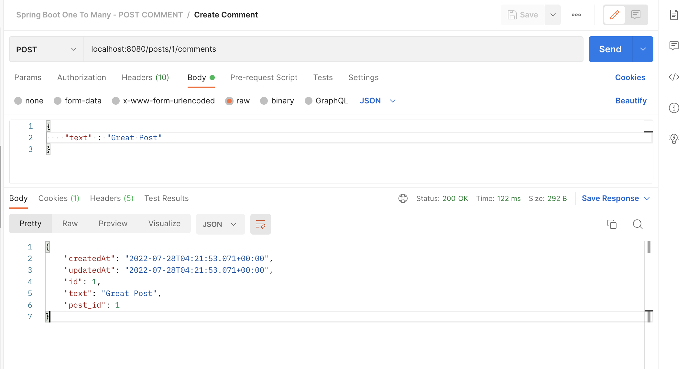
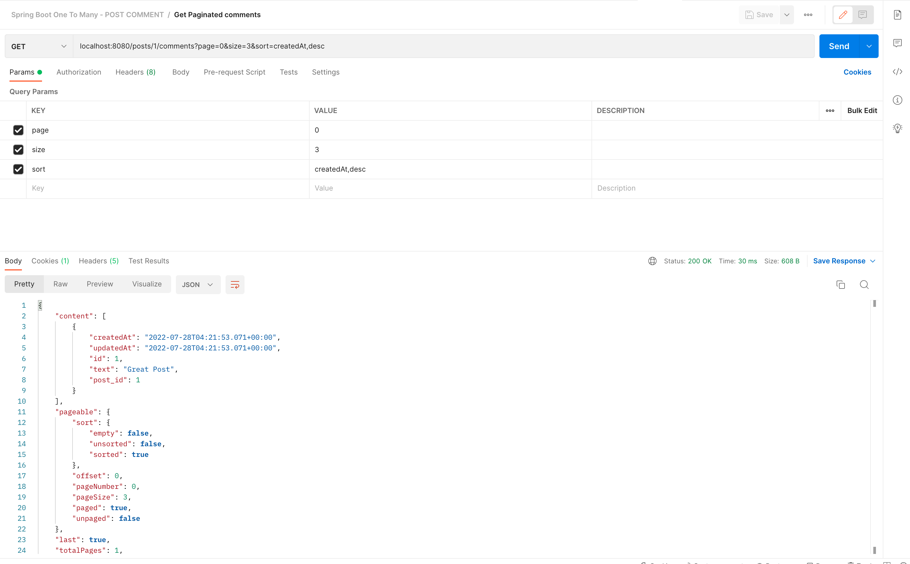
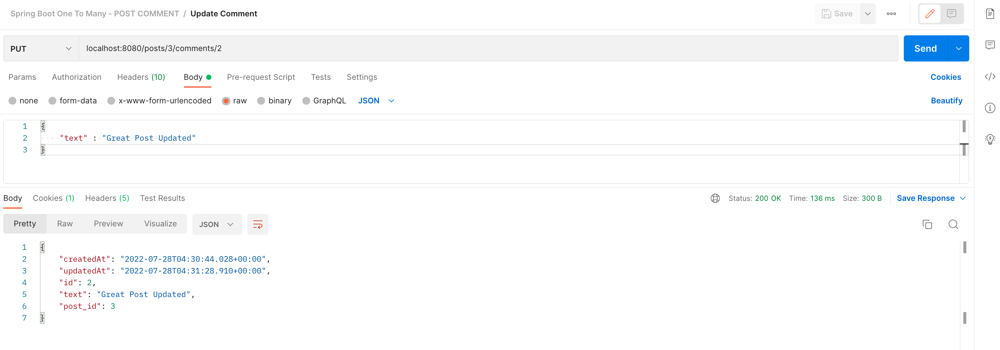
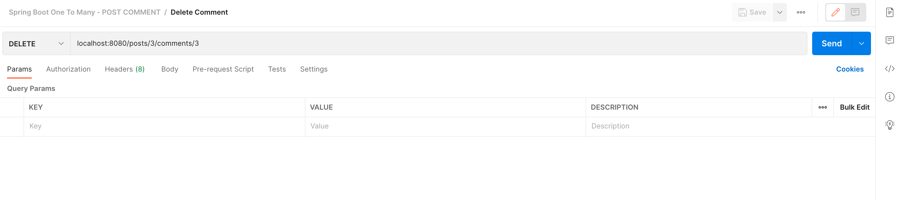

# Spring Boot One To Many

### Things todo list:

1. Clone this repository: `git clone https://gitlab.com/hendisantika/spring-boot-one-to-many.git`
2. Navigate to the folder: `cd spring-boot-one-to-many`
3. Change MySQL credentials with your own in `application.properties` file
4. Run application: `mvn clean spring-boot:run`
5. Open Postman App or import the Postman collection file

### Image Screen shots

Diagram



Add Post



```shell
curl --location --request POST 'localhost:8080/posts' \
--header 'Content-Type: application/json' \
--data-raw '{
    "title" : "Post 4",
    "description": "Post 4 description",
    "content": "Post 4 Content"
}'
```

List Posts



```shell
curl --location --request GET 'localhost:8080/posts?page=0&size=2&sort=createdAt,desc' \
```

Update Post



```shell
curl --location --request POST 'localhost:8080/posts/3/comments' \
--header 'Content-Type: application/json' \
--data-raw '{
    "text" : "Great Post"
}'
```

Delete Post


```shell
curl --location --request DELETE 'localhost:8080/posts/5'
```

Add Comment



```shell
curl --location --request POST 'localhost:8080/posts/3/comments' \
--header 'Content-Type: application/json' \
--data-raw '{
    "text" : "Great Post"
}'
```

List Comments



```shell
curl --location --request GET 'localhost:8080/posts/3/comments?page=0&size=3&sort=createdAt,desc' \
```

Update Comment



```shell
curl --location --request PUT 'localhost:8080/posts/3/comments/2' \
--header 'Content-Type: application/json' \
--data-raw '{
    "text" : "Great Post Updated"
}'
```

Delete Comment



```shell
curl --location --request DELETE 'localhost:8080/posts/3/comments/3' \
```